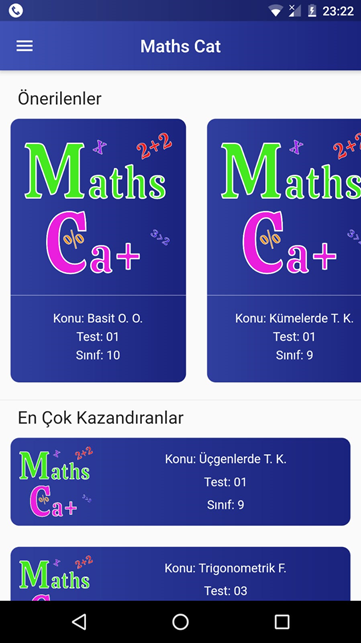
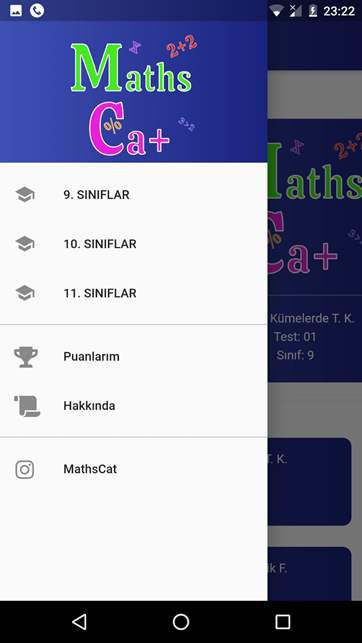
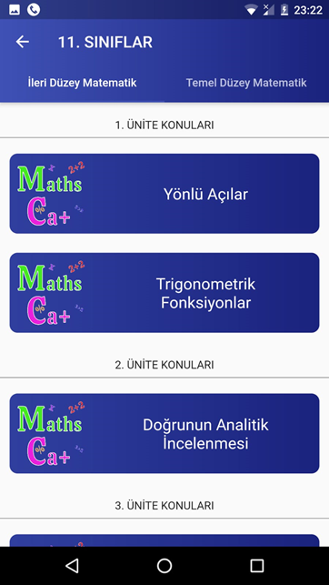
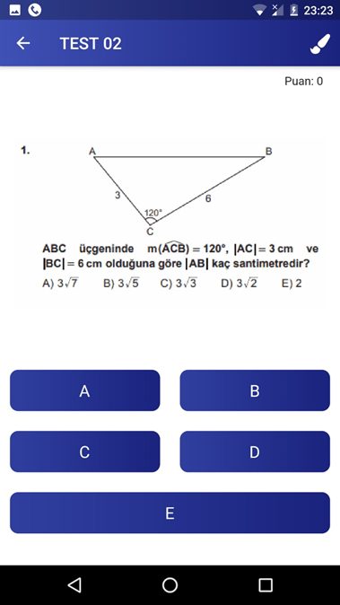
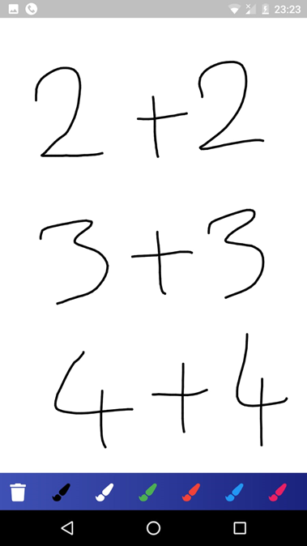
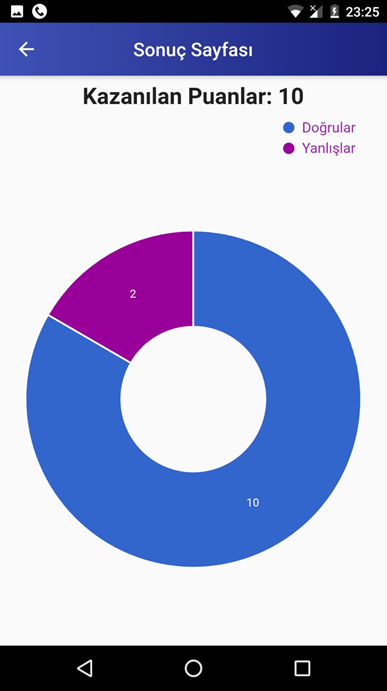
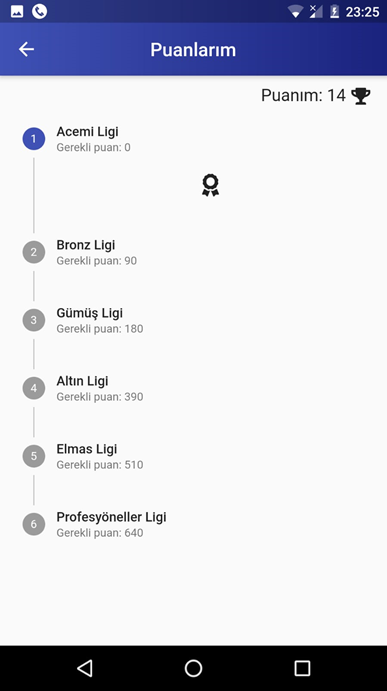

# MathsCat
Bu projeyi yaparken pandemi sürecinde internet erişiminde güçlük çeken öğrenciler için ebadaki testlere eğlenceli ve internetsiz bir şekilde ulşabilmelerini hedefledim.

## Screenshots
        
        
        

